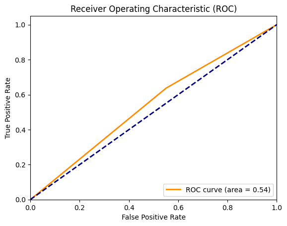

# Match Outcome Prediction Using Logistic Regression in PyTorch

### Introduction

This analysis is the final project of the course [Introduction to Neural Networks and PyTorch by IBM](https://www.coursera.org/learn/deep-neural-networks-with-pytorch).

League of Legends, a popular multiplayer online battle arena (MOBA) game, generates extensive data from matches. This project builds a logistic regression model that aimed at predicting the outcomes of League of Legends matches.  

Data: [league_of_legends_data_large.csv](https://cf-courses-data.s3.us.cloud-object-storage.appdomain.cloud/rk7VDaPjMp1h5VXS-cUyMg/league-of-legends-data-large.csv) 

### Step 1: Data Loading and Preprocessing  

#### Task 1: Load the League of Legends dataset and preprocess it for training.  

Loading and preprocessing the dataset involves reading the data, splitting it into training and testing sets, and standardizing the features. You will utilize `pandas` for data manipulation, `train_test_split` from `sklearn` for data splitting, and `StandardScaler` for feature scaling.  

1. Load the dataset:
  - Use `pd.read_csv()` to load the dataset into a pandas DataFrame.

2. Split data into features and target: Separate win (target) and the remaining columns (features).
  - X = data.drop('win', axis=1)
  - y = data['win']
3 .Split the Data into Training and Testing Sets:
  - Use `train_test_split()` from `sklearn.model_selection` to divide the data. Set `test_size`=0.2 to allocate 20% for testing and 80% for training, and use `random_state`=42 to ensure reproducibility of the split.
4. Standardize the features:
  - Use `StandardScaler()` from sklearn.preprocessing to scale the features.
5. Convert to PyTorch tensors:
  - Use `torch.tensor()` to convert the data to PyTorch tensors.

 
#### Task 1: Implementation
Write code to load the dataset, split it into training and testing sets, standardize the features, and convert the data into PyTorch tensors for use in training a PyTorch model.


```python
# Installing required libraries
!pip install pandas
!pip install scikit-learn
!pip install torch
!pip install matplotlib
```


```python
import pandas as pd
from sklearn.model_selection import train_test_split
from sklearn.preprocessing import StandardScaler
import torch
df=pd.read_csv("https://cf-courses-data.s3.us.cloud-object-storage.appdomain.cloud/rk7VDaPjMp1h5VXS-cUyMg/league-of-legends-data-large.csv")
y=df['win']
X=df.drop('win', axis=1)

# Split the data into training and test sets
X_train, X_test, y_train, y_test = train_test_split(X, y, test_size=0.2, random_state=42, stratify=y)

# Standardize the data
# Initialize the StandardScaler
scaler = StandardScaler()
# Fit the scaler on the training data and transform it
X_train = scaler.fit_transform(X_train)
# Transform the test data using the same scaler
X_test = scaler.transform(X_test)

# Convert to PyTorch tensors
X_train = torch.tensor(X_train, dtype=torch.float32)
X_test = torch.tensor(X_test, dtype=torch.float32)
y_train = torch.tensor(y_train.values, dtype=torch.float32).unsqueeze(1)
y_test = torch.tensor(y_test.values, dtype=torch.float32).unsqueeze(1)
```

### Step 2: Logistic Regression Model  

#### Task 2: Implement a logistic regression model using PyTorch.  

Defining the logistic regression model involves specifying the input dimensions, the forward pass using the sigmoid activation function, and initializing the model, loss function, and optimizer.  

1 .Define the Logistic Regression Model:
  - Create a class LogisticRegressionModel that inherits from torch.nn.Module.
  - In the `__init__()` method, define a linear layer (nn.Linear) to implement the logistic regression model.
  - The `forward()` method should apply the sigmoid activation function to the output of the linear layer.

2.Initialize the Model, Loss Function, and Optimizer:
  - Set input_dim: Use `X_train.shape[1]` to get the number of features from the training data (X_train).
  - Initialize the model: Create an instance of the LogisticRegressionModel class  (e.g., `model = LogisticRegressionModel()`)while passing input_dim as a parameter
  - Loss Function: Use `BCELoss()` from torch.nn (Binary Cross-Entropy Loss).
  - Optimizer: Initialize the optimizer using `optim.SGD()` with a learning rate of 0.01

#### Task 2: Implementation
Define the logistic regression model using PyTorch, specifying the input dimensions and the forward pass. Initialize the model, loss function, and optimizer.


```python

import torch.nn as nn
import torch.optim as optim

class LogisticRegressionModel(nn.Module):
    # Constructor
    def __init__(self, n_inputs):
        super(LogisticRegressionModel, self).__init__()
        self.linear = nn.Linear(n_inputs, 1)

    # Prediction
    def forward(self, x):
        z=torch.sigmoid(self.linear(x))
        return z

# Instantiate the model
input_dim = X_train.shape[1]
model = LogisticRegressionModel(input_dim)
criterion = nn.BCELoss()
optimizer = torch.optim.SGD(model.parameters(), lr=0.01)

print(f'input_dim = {input_dim}')
# X_train.shape
# X_test.shape
# y_train.shape
```

    input_dim = 8


### Step 3: Model Training  

#### Task 3: Train the logistic regression model on the dataset.  

The training loop will run for a specified number of epochs. In each epoch, the model makes predictions, calculates the loss, performs backpropagation, and updates the model parameters.

1. Set Number of Epochs:  
   - Define the number of epochs for training to 1000.
2. Training Loop:  
   For each epoch:
   - Set the model to training mode using `model.train()`.
   - Zero the gradients using `optimizer.zero_grad()`.
   - Pass the training data (`X_train`) through the model to get the predictions (`outputs`).
   - Calculate the loss using the defined loss function (`criterion`).
   - Perform backpropagation with `loss.backward()`.
   - Update the model's weights using `optimizer.step()`.

3. Print Loss Every 100 Epochs:  
   - After every 100 epochs, print the current epoch number and the loss value.

4. Model Evaluation:  
   - Set the model to evaluation mode using `model.eval()`.
   - Use `torch.no_grad()` to ensure no gradients are calculated during evaluation.
   - Get predictions on both the training set (`X_train`) and the test set (`X_test`).

5. Calculate Accuracy:  
   - For both the training and test datasets, compute the accuracy by comparing the predicted values with the true values (`y_train`, `y_test`).
   - Use a threshold of 0.5 for classification
   
6. Print Accuracy:  
   - Print the training and test accuracies after the evaluation is complete.
 
#### Task 3: Implementation
Write the code to train the logistic regression model on the dataset. Implement the training loop, making predictions, calculating the loss, performing backpropagation, and updating model parameters. Evaluate the model's accuracy on training and testing sets.


```python

epochs=1000
for epoch in range(epochs):
    model.train()
    optimizer.zero_grad()
    outputs = model(X_train)
    loss = criterion(outputs, y_train)
    loss.backward()
    optimizer.step()
    if (epoch-1) % 100 == 0:
        print(f'{epoch=}, loss={loss.item()}')

model.eval()
with torch.no_grad():
    train_outputs = model(X_train)
    test_outputs = model(X_test)

train_label = train_outputs > 0.5
test_label = test_outputs > 0.5

print("Training accuracy : ", (train_label == y_train).float().mean())
print("Test accuracy : ", (test_label == y_test).float().mean())

```

    epoch=1, loss=0.7351216673851013
    epoch=101, loss=0.7176522016525269
    epoch=201, loss=0.7066901922225952
    epoch=301, loss=0.7000060081481934
    epoch=401, loss=0.6960073709487915
    epoch=501, loss=0.6936435103416443
    epoch=601, loss=0.6922555565834045
    epoch=701, loss=0.6914436221122742
    epoch=801, loss=0.6909697651863098
    epoch=901, loss=0.6906931400299072
    Training accuracy :  tensor(0.5238)
    Test accuracy :  tensor(0.5150)


### Step 4: Model Optimization and Evaluation  

#### Task 4: Implement optimization techniques and evaluate the model's performance.  

Optimization techniques such as L2 regularization (Ridge Regression) help in preventing overfitting. The model is retrained with these optimizations, and its performance is evaluated on both training and testing sets. 

**Weight Decay** :In the context of machine learning and specifically in optimization algorithms, weight_decay is a parameter used to apply L2 regularization to the model's parameters (weights). It helps prevent the model from overfitting by penalizing large weight values, thereby encouraging the model to find simpler solutions.To use L2 regularization, you need to modify the optimizer by setting the weight_decay parameter. The weight_decay parameter in the optimizer adds the L2 regularization term during training.
For example, when you initialize the optimizer with optim.SGD(model.parameters(), lr=0.01, weight_decay=0.01), the weight_decay=0.01 term applies L2 regularization with a strength of 0.01.

1. Set Up the Optimizer with L2 Regularization:
   - Modify the optimizer to include `weight_decay` for L2 regularization.
   - Example:
     ```python
     optimizer = optim.SGD(model.parameters(), lr=0.01, weight_decay=0.01)
     ```
2. Train the Model with L2 Regularization:
    - Follow the same steps as before but use the updated optimizer with regularization during training.
    - Use epochs=1000
   
3. Evaluate the Optimized Model:
   - After training, evaluate the model on both the training and test datasets.
   - Compute the accuracy for both sets by comparing the model's predictions to the true labels (`y_train` and `y_test`).

4. Calculate and Print the Accuracy:
   - Use a threshold of 0.5 to determine whether the model's predictions are class 0 or class 1.
   - Print the training accuracy and test accuracy  after evaluation.

#### Task 4: Implementation
Implement optimization techniques like L2 regularization and retrain the model. Evaluate the performance of the optimized model on both training and testing sets.


```python
# L2
optimizer = optim.SGD(model.parameters(), lr=0.01, weight_decay=0.01)

epochs=1000
for epoch in range(epochs):
    model.train()
    optimizer.zero_grad()
    outputs = model(X_train)
    loss = criterion(outputs, y_train)
    loss.backward()
    optimizer.step()
    if (epoch-1) % 100 == 0:
        print(f'{epoch=}, loss={loss.item()}')

model.eval()
with torch.no_grad():
    train_outputs = model(X_train)
    test_outputs = model(X_test)

train_label = train_outputs > 0.5
test_label = test_outputs > 0.5

print("Training accuracy : ", (train_label == y_train).float().mean())
print("Test accuracy : ", (test_label == y_test).float().mean())
```

    epoch=1, loss=0.6905315518379211
    epoch=101, loss=0.6904350519180298
    epoch=201, loss=0.6903800964355469
    epoch=301, loss=0.6903488039970398
    epoch=401, loss=0.6903311014175415
    epoch=501, loss=0.6903209686279297
    epoch=601, loss=0.6903151869773865
    epoch=701, loss=0.6903119683265686
    epoch=801, loss=0.6903100609779358
    epoch=901, loss=0.6903090476989746
    Training accuracy :  tensor(0.5200)
    Test accuracy :  tensor(0.5450)


### Step 5: Visualization and Interpretation  

Visualization tools like confusion matrices and ROC curves provide insights into the model's performance. The confusion matrix helps in understanding the classification accuracy, while the ROC curve illustrates the trade-off between sensitivity and specificity.

Confusion Matrix : A Confusion Matrix is a fundamental tool used in classification problems to evaluate the performance of a model. It provides a matrix showing the number of correct and incorrect predictions made by the model, categorized by the actual and predicted classes.
Where 
- True Positive (TP): Correctly predicted positive class (class 1).
- True Negative (TN): Correctly predicted negative class (class 0).
- False Positive (FP): Incorrectly predicted as positive (class 1), but the actual class is negative (class 0). This is also called a Type I error.
- False Negative (FN): Incorrectly predicted as negative (class 0), but the actual class is positive (class 1). This is also called a Type II error. 

ROC Curve (Receiver Operating Characteristic Curve):
The ROC Curve is a graphical representation used to evaluate the performance of a binary classification model across all classification thresholds. It plots two metrics:
- True Positive Rate (TPR) or Recall (Sensitivity)-It is the proportion of actual positive instances (class 1) that were correctly classified as positive by the model.
- False Positive Rate (FPR)-It is the proportion of actual negative instances (class 0) that were incorrectly classified as positive by the model.
  
AUC: 
AUC stands for Area Under the Curve and is a performance metric used to evaluate the quality of a binary classification model. Specifically, it refers to the area under the ROC curve (Receiver Operating Characteristic curve), which plots the True Positive Rate (TPR) versus the False Positive Rate (FPR) for different threshold values.

Classification Report:
A Classification Report is a summary of various classification metrics, which are useful for evaluating the performance of a classifier on the given dataset.

#### Task 5: Implementation
Write code to visualize the model's performance using confusion matrices and ROC curves. Generate classification reports to evaluate precision, recall, and F1-score. Retrain the model with L2 regularization and evaluate the performance.


```python

from sklearn.metrics import classification_report, confusion_matrix, roc_curve, auc
import itertools
import numpy as np

# confusion matrix
def plot_confusion_matrix(cm, classes,
                          normalize=False,
                          title='Confusion matrix',
                          cmap=plt.cm.Blues):
    """
    This function prints and plots the confusion matrix.
    Normalization can be applied by setting `normalize=True`.
    """
    if normalize:
        cm = cm.astype('float') / cm.sum(axis=1)[:, np.newaxis]
        print("Normalized confusion matrix")
    else:
        print('Confusion matrix, without normalization')

    print(cm)

    plt.imshow(cm, interpolation='nearest', cmap=cmap)
    plt.title(title)
    plt.colorbar()
    tick_marks = np.arange(len(classes))
    plt.xticks(tick_marks, classes, rotation=45)
    plt.yticks(tick_marks, classes)

    fmt = '.2f' if normalize else 'd'
    thresh = cm.max() / 2.
    for i, j in itertools.product(range(cm.shape[0]), range(cm.shape[1])):
        plt.text(j, i, format(cm[i, j], fmt),
                 horizontalalignment="center",
                 color="white" if cm[i, j] > thresh else "black")

    plt.tight_layout()
    plt.ylabel('True label')
    plt.xlabel('Predicted label')

test_label = test_outputs > 0.5
cnf_matrix = confusion_matrix(y_test, test_label, labels=[1,0])
np.set_printoptions(precision=2)
plt.figure()
plot_confusion_matrix(cnf_matrix, classes=['churn=1','churn=0'],normalize= False,  title='Confusion matrix')


# Plot ROC curve
fpr, tpr, thresholds = roc_curve(y_test, test_label)
roc_auc = auc(fpr, tpr)

plt.figure()
plt.plot(fpr, tpr, color='darkorange', lw=2, label=f'ROC curve (area = {roc_auc:.2f})')
plt.plot([0, 1], [0, 1], color='navy', lw=2, linestyle='--')
plt.xlim([0.0, 1.0])
plt.ylim([0.0, 1.05])
plt.xlabel('False Positive Rate')
plt.ylabel('True Positive Rate')
plt.title('Receiver Operating Characteristic (ROC)')
plt.legend(loc="lower right")
plt.show()


# Classification report
print (classification_report(y_test, test_label))

```

    Confusion matrix, without normalization
    [[65 37]
     [54 44]]


    

    


    

    


                  precision    recall  f1-score   support
    
             0.0       0.54      0.45      0.49        98
             1.0       0.55      0.64      0.59       102
    
        accuracy                           0.55       200
       macro avg       0.54      0.54      0.54       200
    weighted avg       0.54      0.55      0.54       200
    


### Step 6: Model Saving and Loading  

#### Task 6: Save and load the trained model.  

This task demonstrates the techniques to persist a trained model using `torch.save` and reload it using `torch.load`. Evaluating the loaded model ensures that it retains its performance, making it practical for deployment in real-world applications.  

1. Saving the Model:
  - Save the model's learned weights and biases using torch.save().( e.g. , torch.save(model.state_dict(), 'your_model_name.pth'))
  - Saving only the state dictionary (model parameters) is preferred because it’s more flexible and efficient than saving the entire model object.

2. Loading the Model:
  - Create a new model instance (e.g., `model = LogisticRegressionModel()`) and load the saved parameters. ( e.g. , `model.load_state_dict(torch.load('your_model_name.pth'))`).

3. Evaluating the Loaded Model:
   - After loading, set the model to evaluation mode by calling `model.eval()`
   - After loading the model, evaluate it again on the test dataset to make sure it performs similarly to when it was first trained..Now evaluate it on the test data.
   - Use `torch.no_grad()` to ensure that no gradients are computed.

#### Task 6: Implementation
Write code to save the trained model and reload it. Ensure the loaded model performs consistently by evaluating it on the test dataset. 


```python

# Save the model
torch.save(model.state_dict(), 'your_model_name.pth')

# Load the model
model = LogisticRegressionModel(input_dim)
model.load_state_dict(torch.load('your_model_name.pth'))

# Ensure the loaded model is in evaluation mode

model.eval()
with torch.no_grad():
    test_outputs = model(X_test)

# Evaluate the loaded model
test_label = test_outputs > 0.5

print("Test accuracy : ", (test_label == y_test).float().mean())
```

### Step 7: Hyperparameter Tuning  

#### Task 7: Perform hyperparameter tuning to find the best learning rate.  

By testing different learning rates, you will identify the optimal rate that provides the best test accuracy. This fine-tuning is crucial for enhancing model performance . 
1. Define Learning Rates:
  - Choose these learning rates to test ,[0.01, 0.05, 0.1]

2. Reinitialize the Model for Each Learning Rate:
  - For each learning rate, you’ll need to reinitialize the model and optimizer e.g.(`torch.optim.SGD(model.parameters(), lr=lr)`).
  - Each new learning rate requires reinitializing the model since the optimizer and its parameters are linked to the learning rate.

3. Train the Model for Each Learning Rate:
  - Train the model for a fixed number of epochs (e.g., 50 or 100 epochs) for each learning rate, and compute the accuracy on the test set.
  - Track the test accuracy for each learning rate and identify which one yields the best performance.

4. Evaluate and Compare:
  - After training with each learning rate, compare the test accuracy for each configuration.
   - Report the learning rate that gives the highest test accuracy


#### Task 7: Implementation
Perform hyperparameter tuning to find the best learning rate. Retrain the model for each learning rate and evaluate its performance to identify the optimal rate.


```python
learning_rates = [0.01, 0.05, 0.1]
best_accuracy = 0
best_lr = 0

for lr in learning_rates:

    model = LogisticRegressionModel(input_dim)
    criterion = nn.BCELoss()
    optimizer = torch.optim.SGD(model.parameters(), lr=0.01)

    epochs=1000
    for epoch in range(epochs):
        model.train()
        optimizer.zero_grad()
        outputs = model(X_train)
        loss = criterion(outputs, y_train)
        loss.backward()
        optimizer.step()
        if (epoch-1) % 100 == 0:
            print(f'{lr=}, {epoch=}, loss={loss.item()}')

    model.eval()
    with torch.no_grad():
        train_outputs = model(X_train)
        test_outputs = model(X_test)

        train_label = train_outputs > 0.5
        test_label = test_outputs > 0.5
        test_accuracy = (test_label == y_test).float().mean()
        print("Test accuracy : ", test_accuracy)

        if (test_accuracy > best_accuracy):
            best_accuracy = test_accuracy
            best_lr = lr
print(f'{best_lr=}, {best_accuracy=}')
```

    lr=0.01, epoch=1, loss=0.7272074818611145
    lr=0.01, epoch=101, loss=0.7126162648200989
    lr=0.01, epoch=201, loss=0.7036827206611633
    lr=0.01, epoch=301, loss=0.6982945203781128
    lr=0.01, epoch=401, loss=0.6950703263282776
    lr=0.01, epoch=501, loss=0.6931479573249817
    lr=0.01, epoch=601, loss=0.692002534866333
    lr=0.01, epoch=701, loss=0.6913199424743652
    lr=0.01, epoch=801, loss=0.6909125447273254
    lr=0.01, epoch=901, loss=0.6906691193580627
    Test accuracy :  tensor(0.5250)
    lr=0.05, epoch=1, loss=0.7290753126144409
    lr=0.05, epoch=101, loss=0.7147523760795593
    lr=0.05, epoch=201, loss=0.7055988311767578
    lr=0.05, epoch=301, loss=0.6998367309570312
    lr=0.05, epoch=401, loss=0.6962400674819946
    lr=0.05, epoch=501, loss=0.6940035820007324
    lr=0.05, epoch=601, loss=0.6926141977310181
    lr=0.05, epoch=701, loss=0.691750168800354
    lr=0.05, epoch=801, loss=0.6912119388580322
    lr=0.05, epoch=901, loss=0.6908755302429199
    Test accuracy :  tensor(0.5300)
    lr=0.1, epoch=1, loss=0.7289024591445923
    lr=0.1, epoch=101, loss=0.714150607585907
    lr=0.1, epoch=201, loss=0.7048901319503784
    lr=0.1, epoch=301, loss=0.6991775631904602
    lr=0.1, epoch=401, loss=0.6956901550292969
    lr=0.1, epoch=501, loss=0.6935731768608093
    lr=0.1, epoch=601, loss=0.6922907829284668
    lr=0.1, epoch=701, loss=0.6915143728256226
    lr=0.1, epoch=801, loss=0.6910433769226074
    lr=0.1, epoch=901, loss=0.690757155418396
    Test accuracy :  tensor(0.5400)
    best_lr=0.1, best_accuracy=tensor(0.5400)


### Step 8: Feature Importance  

#### Task 8: Evaluate feature importance to understand the impact of each feature on the prediction.  

The code to evaluate feature importance to understand the impact of each feature on the prediction.

1. Extracting Model Weights:
  - The weights of the logistic regression model represent the importance of each feature in making predictions. These weights are stored in the model's linear layer (`model.linear.weight`).
  - You can extract the weights using `model.linear.weight.data.numpy()` and flatten the resulting tensor to get a 1D array of feature importances.

2. Creating a DataFrame:
  - Create a pandas DataFrame with two columns: one for the feature names and the other for their corresponding importance values (i.e., the learned weights).
  - Ensure the features are aligned with their names in your dataset (e.g., `X_train.columns`).

3. Sorting and Plotting Feature Importance:
  - Sort the features based on the absolute value of their importance (weights) to identify the most impactful features.
  - Use a bar plot (via `matplotlib`) to visualize the sorted feature importances, with the feature names on the y-axis and importance values on the x-axis.

4. Interpreting the Results:
  - Larger absolute weights indicate more influential features. Positive weights suggest a positive correlation with the outcome (likely to predict the positive class), while negative weights suggest the opposite.

 
#### Task 8: Implementation
Evaluate feature importance by extracting the weights of the linear layer and creating a DataFrame to display the importance of each feature. Visualize the feature importance using a bar plot.


```python
import pandas as pd
import matplotlib.pyplot as plt

# Extract the weights of the linear layer
## Write your code here
w = model.linear.weight.data.numpy().flatten()

# Create a DataFrame for feature importance
## Write your code here
df_w = pd.DataFrame({'Feature' : X.columns,'Weight':w})
df_w = df_w.sort_values('Weight', ascending=False)

print(df_w)

# Plot feature importance
plt.figure(figsize=(6, 6))
plt.bar(df_w['Feature'], df_w['Weight'])
plt.xlabel('Features')
plt.ylabel('Weight')
plt.title('Feature Importance')
plt.xticks(rotation=45)
plt.show()


```

            Feature    Weight
    3   gold_earned  0.080194
    0         kills  0.072249
    5  wards_placed  0.068960
    4            cs -0.004865
    1        deaths -0.008046
    2       assists -0.027868
    6  wards_killed -0.030438
    7  damage_dealt -0.082819


    

    

